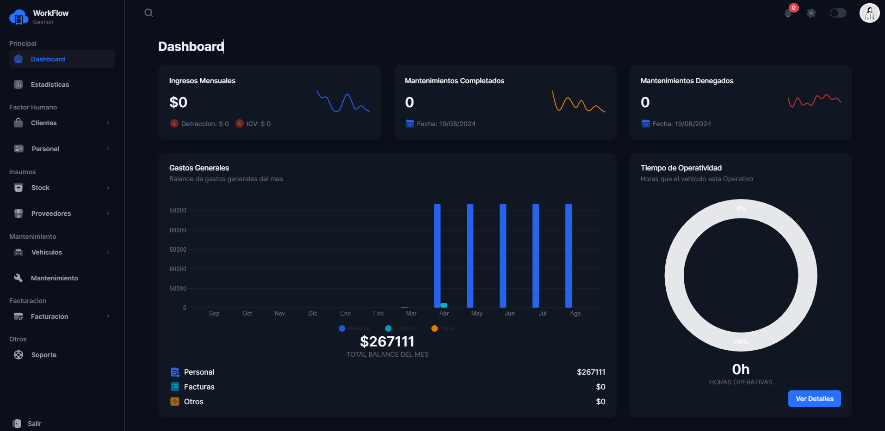

# Next.js Dashboard with GraphQL, Apollo Client, and NextAuth

## Features

- **Next.js App Router**: Optimized navigation and advanced routing for the application.
- **GraphQL**: Query interface for the API, providing a flexible and efficient way to handle data.
- **Apollo Client**: Library for managing state and data in the application, easily integrating GraphQL.
- **NextAuth**: Comprehensive authentication solution, supporting OAuth, JWT, and more.

## Installation

Follow the steps below to set up and run this project on your local machine.

### Prerequisites

- Node.js (v16 or higher)
- npm or yarn

### Clone the Repository

```bash
git clone https://github.com/xeppadev/Dashboard_nextJs_GraphQL.git
cd your-repository

```

### Install Dependencies

```bash
npm install
# or
yarn install
```

### Environment Configuration

Create a .env.local file in the root of the project and add the following environment variables:

```bash
NEXT_PUBLIC_GRAPHQL_URL = 
NEXT_API_URL = 
NEXT_PUBLIC_API_URL =
NEXTAUTH_URL = 
NEXTAUTH_SECRET=************
```

### Getting Started

First, run the development server:

```bash
npm run dev
# or
yarn dev
# or
pnpm dev
# or
bun dev
```

## Usage

### Authentication

This project uses NextAuth to manage authentication. Users can log in using OAuth providers like Google, GitHub, etc.

### Queries and Mutations

Apollo Client handles data management using GraphQL. You can execute queries and mutations directly from the components.

### Project Structure

```plaintext
Project/
├── app/
│ ├── page.tsx
│ └── layout.tsx
├── src/
│ ├── entities/
│ │ └── User.ts
│ ├── generated/
│ │ └── schema.graphql.ts
│ ├── hooks/
│ │ └── useAuth.ts
│ ├── models/
│ │ └── UserModel.ts
│ ├── repositories/
│ │ └── UserRepository.ts
├── components/
│ ├── Header.tsx
│ ├── Footer.tsx
├── lib/
│ ├── apolloClient.ts
│ ├── auth.ts
├── styles/
│ └── globals.css
└── .env.local
```

## Deployment

You can deploy this application using services like Vercel, which natively supports Next.js.

### Deploy on Vercel

Connect your repository to Vercel.
Set up environment variables in Vercel.
Deploy the application with a single click.

## Screenshots


